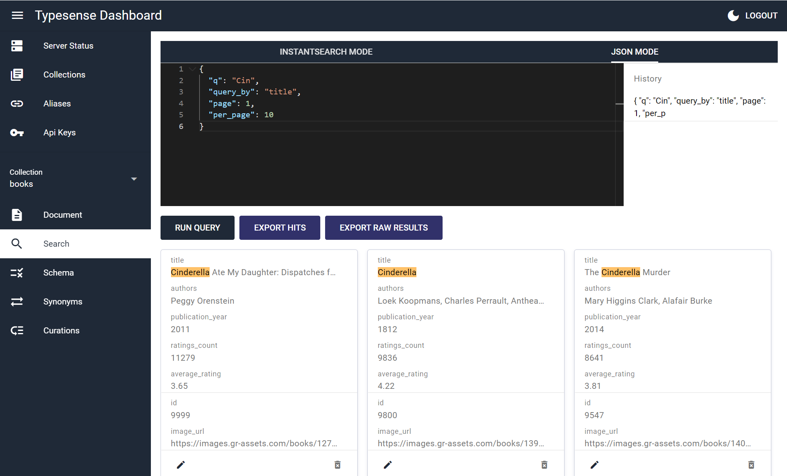

# Typesense Dashboard (typesense-dashboard)

A Typesense Dashboard to manage and browse collections.

A side project to test the Typesense API and Quasar with electron.

## Usage

### Web
As a web application, only typesense server started with `--enable-cors` will work.

Use https://bfritscher.github.io/typesense-dashboard/ or build and install on your own server

#### Limitation
When using in your browser from an https address your server must also be behind SSL. Or you will get a MixedContent Network Error. (You might allow mix content in your browser, but this is not recommended).


#### Docker

self-host this dashboard with docker* (web version has some limitations import/export size of files)

use environment variable `PUBLIC_PATH` if you need something else than `/`

Example usage:
```bash
$ docker build -t typesense-dashboard .
$ docker run -d -p 80:80 typesense-dashboard
```

`caddy` is used for serving the actual files.
One could also copy `/srv` from the final Docker Image into another:
```Dockerfile
FROM alpine
COPY --from=typesense-dashboard /srv /typesense-dashboard
```

To build and serve from a subfolder `/example` (must start with /)

```bash
docker build --build-arg=PUBLIC_PATH=/example -t typesense-dashboard .
```

You can also use the pre-built docker image for example like this:
```bash
docker run -d -p 80:80 ghcr.io/bfritscher/typesense-dashboard:latest
```

You can enable auto-login by mapping a config.json file to `/srv/config.json` in the container.

```bash
docker run -d -p 80:80 -v /path/to/config.json:/srv/config.json typesense-dashboard
```

Sample config.json (same data as saved in localStorage of the browser).
```json
{
  "apiKey": "xyz",
  "node": {
    "host":"somehost",
    "port":"443",
    "protocol":"https",
    "path":"",
    "tls":true
  }
}
```

#### Kustomize

To use along [Kustomize deployment for Typesense](https://github.com/typesense/typesense-kubernetes)

Example usage [here](kustomize/overlays/dev)

Create `config.json` file with your configuration and API key.

Create kustomization file.
```yml
resources:
- github.com/typesense/typesense-kubernetes/base
- github.com/bfritscher/typesense-dashboard/kustomize/base

namespace: typesense

images:
- name: typesense-dashboard
  newName: typesense-dashboard
  newTag: latest

secretGenerator:
- files:
  - config.json
  name: typesense-dashboard-config
  behavior: replace
  options:
    disableNameSuffixHash: true
  type: Opaque
```


### Desktop

With the desktop application everything except instant search will work without cors.
To export or import large json or ljson files, desktop version is required, because the browser version times out.

Download from the [release page](https://github.com/bfritscher/typesense-dashboard/releases) or build your own.

#### *Linux*
App cannot be started by clicking on it, on Nautilus[*](https://stackoverflow.com/questions/55060402/electron-executable-not-recognized-by-nautilus)

Make it executable and then you can run it from command line.
```
./'Typesense-Dashboard'
```


## Screenshots





## Known Issues and Limitations
- API features not yet implemented:
    - create Snapshot
    - delete by query
    - Scoped Search Key generation

# Development
## Install the dependencies
```bash
yarn
```

### Start the app in development mode (hot-code reloading, error reporting, etc.)
```bash
quasar dev
quasar dev -m electron --devtools
```

### Lint the files
```bash
yarn run lint
```

### Build the app for production
```bash
quasar build
quasar build --mode electron --target all
```

### Customize the configuration
See [Configuring quasar.conf.js](https://v2.quasar.dev/quasar-cli/quasar-conf-js).

    icon
    readme
    deploy


