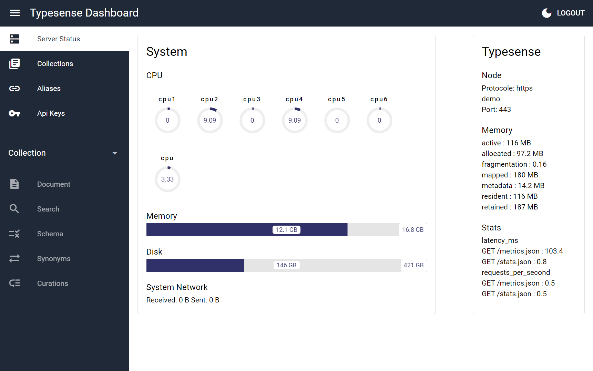
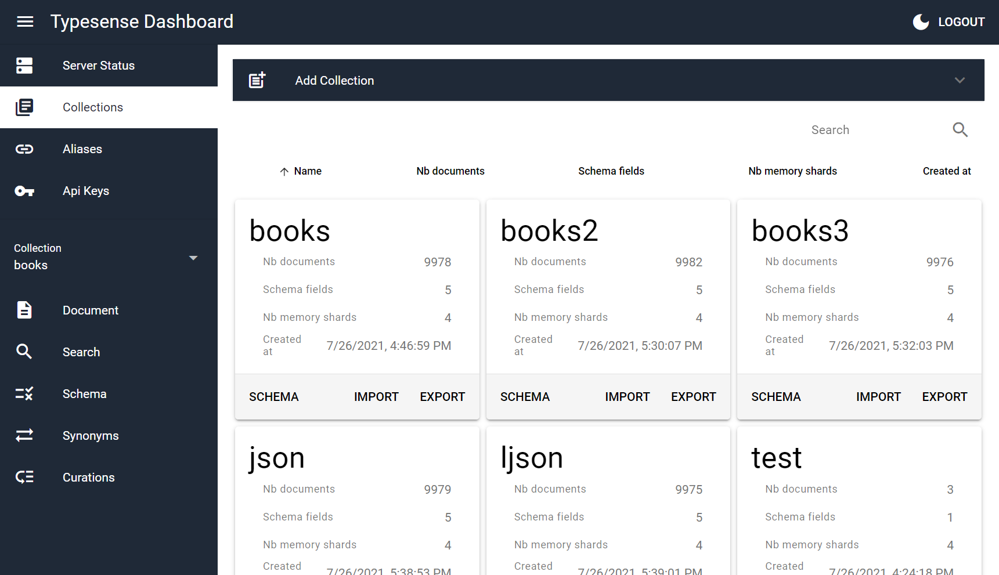
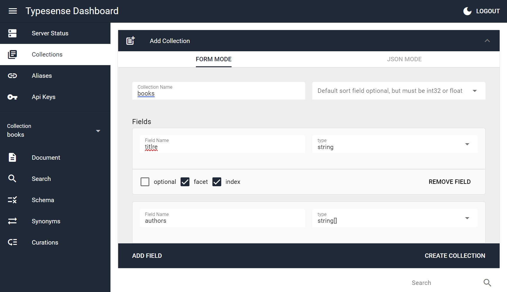
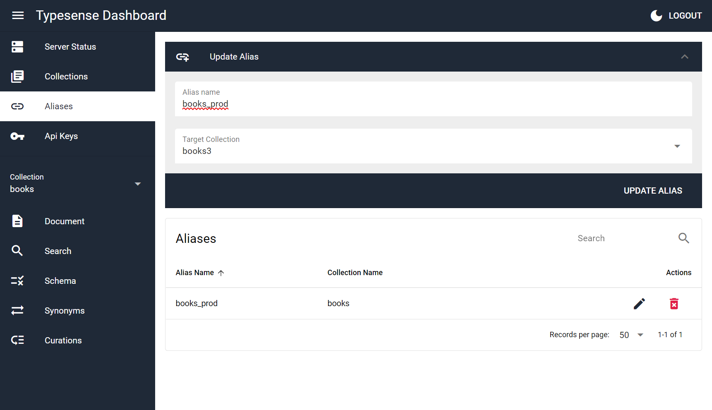
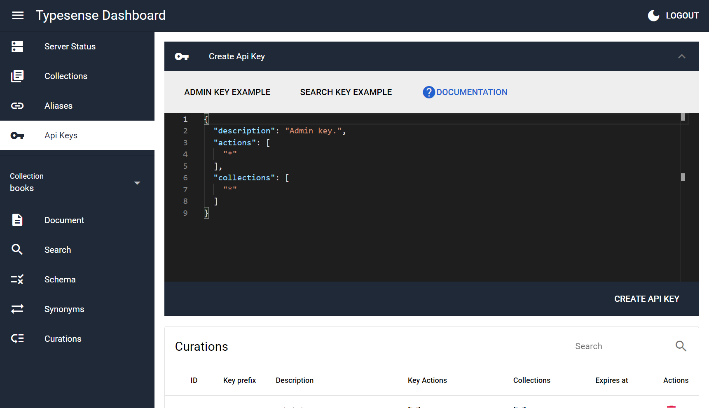
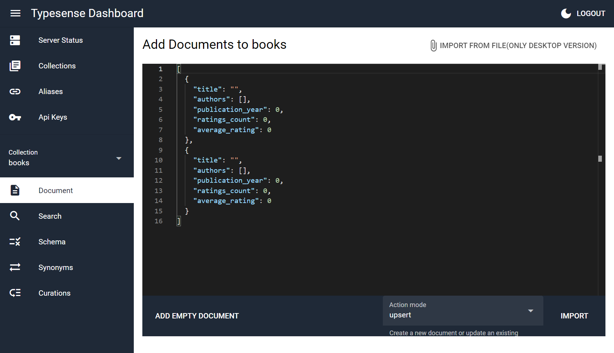
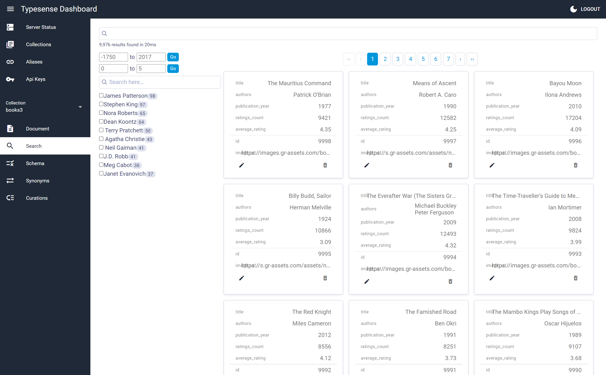
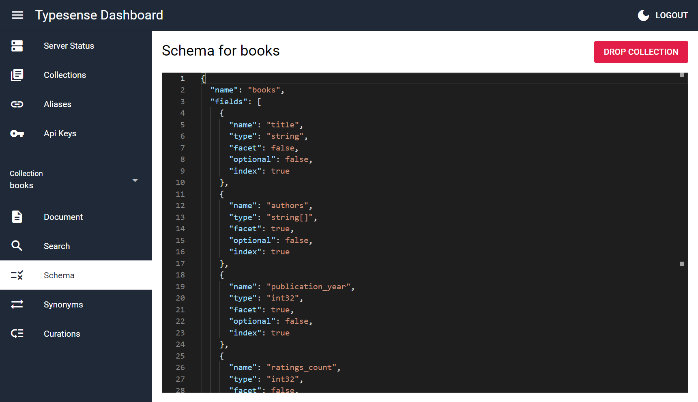
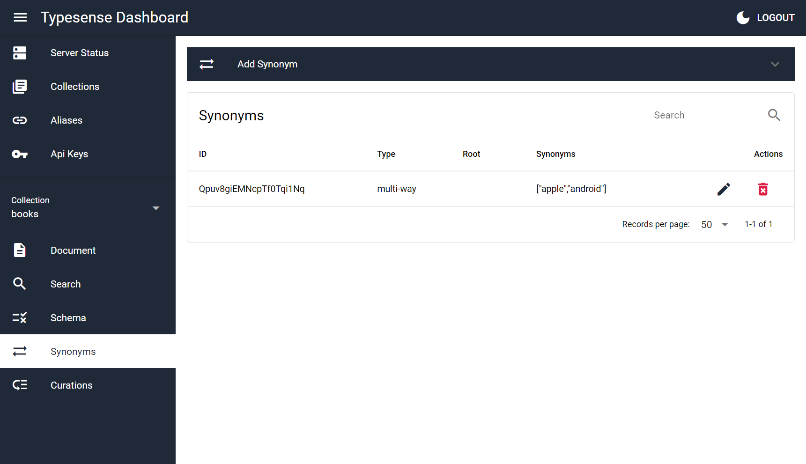
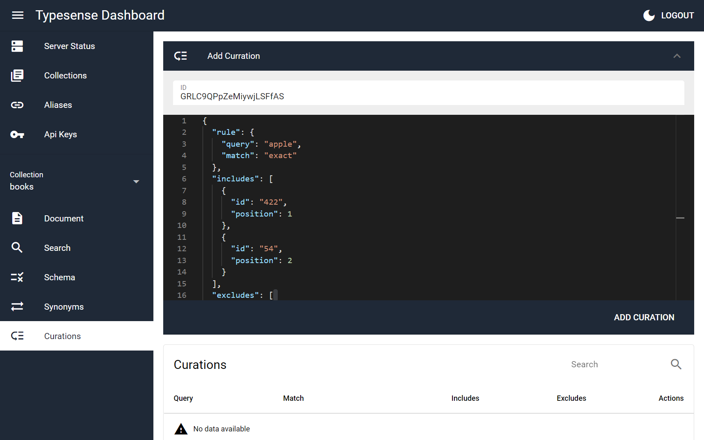

# Typesense Dashboard (typesense-dashboard)

A Typesense Dashboard to manage and browse collections.

A side projet to test the Typesense API and Quasar with electron.

## Usage

### Web
As a web application, only typesense server started with `--enable-cors` will work.

Use https://bfritscher.github.io/typesense-dashboard/ or build and install on your own server

#### Docker

self-host this dashboard with docker* (web version has some limitations import/export size of files)

use environement variable `PUBLIC_PATH` if you need something else than `/`

Example usage:
```bash
$ docker build -t typesense-dashboard .
$ docker run -d -p 80:80 typesense-dashboard
```

`caddy` is used for serving the actual files.
One could also copy `/srv` from the final Docker Image into another:
```Dockerfile
FROM alpine
COPY --from=typesense-dashboard /srv /typesense-dashboard
```

### Desktop

With the desktop application everything except instant search will work without cors.
To export or import large json or ljson files, desktop version is required, because the browser version times out.

Download from the [release page](https://github.com/bfritscher/typesense-dashboard/releases) or build your own.

#### *Linux*
App cannot be started by clicking on it, on Nautilus[*](https://stackoverflow.com/questions/55060402/electron-executable-not-recognized-by-nautilus)

Make it executable and then you can run it from command line.
```
./'Typesense-Dashboard'
```


## Screenshots






















## Known Issues and Limitations
- API features not yet implemented:
    - create Snapshot
    - custom search (with a custom query)
    - delete by query
    - Scoped Search Key generation
- Dark mode not completely implemented

# Development
## Install the dependencies
```bash
yarn
```

### Start the app in development mode (hot-code reloading, error reporting, etc.)
```bash
quasar dev
quasar dev -m electron
```

### Lint the files
```bash
yarn run lint
```

### Build the app for production
```bash
quasar build
quasar build --mode electron --target all
```

### Customize the configuration
See [Configuring quasar.conf.js](https://v2.quasar.dev/quasar-cli/quasar-conf-js).

    icon
    readme
    deploy


