# Typesense Dashboard — Free, Open-Source Admin UI for Typesense

[](./LICENSE.txt)
[](https://github.com/bfritscher/typesense-dashboard/releases)
[](https://github.com/bfritscher/typesense-dashboard/pkgs/container/typesense-dashboard)

**Typesense Dashboard is a free, open-source Typesense admin dashboard and GUI.** Use it to manage, browse, and search your Typesense data from a web browser or desktop app—without building an internal admin tool.

Connect the dashboard to a self-hosted Typesense server or cluster to manage collections, documents, schemas, API keys, aliases, synonyms, curations, search presets, stopwords, stemming dictionaries, analytics rules, and server health.

[Open the web dashboard](https://bfritscher.github.io/typesense-dashboard/) · [Download the desktop app](https://github.com/bfritscher/typesense-dashboard/releases) · [Run with Docker](#run-with-docker)

> This is a community-built Typesense management UI. It is free software licensed under GPL-3.0 and is not an official Typesense product.

## Typesense dashboard screenshots

### Monitor your Typesense server

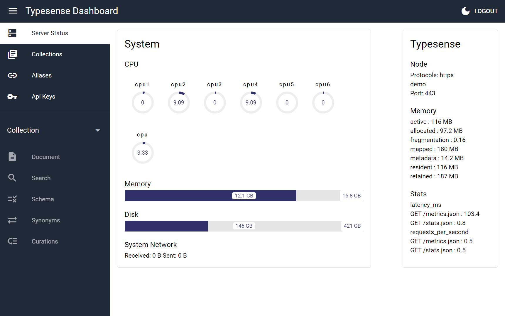

### Manage collections and test search

| Browse Typesense collections                                            | Search and filter documents                                             |
| ----------------------------------------------------------------------- | ----------------------------------------------------------------------- |
| 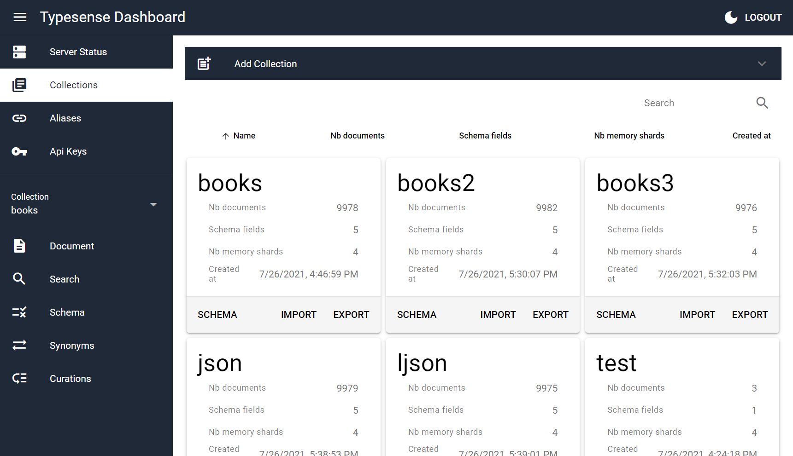 | 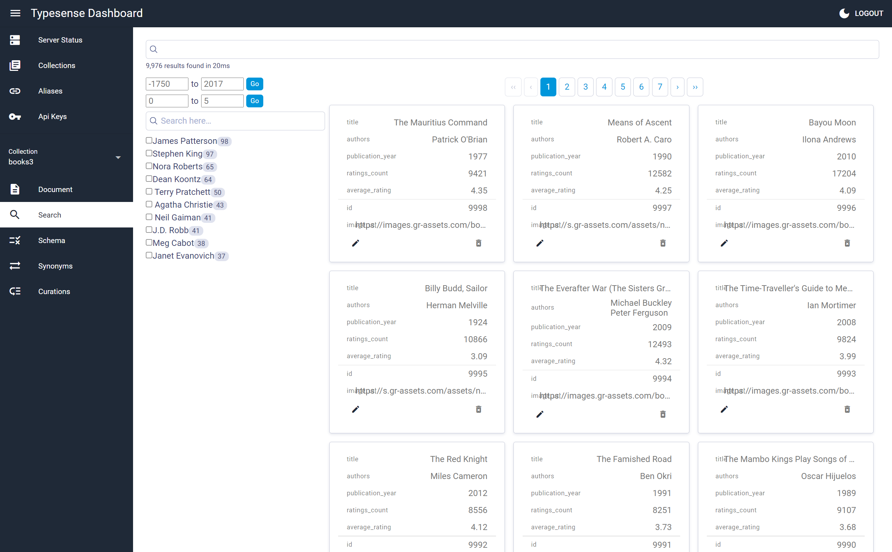 |

| Create a collection                                                  | Edit a collection schema                                      |
| -------------------------------------------------------------------- | ------------------------------------------------------------- |
| 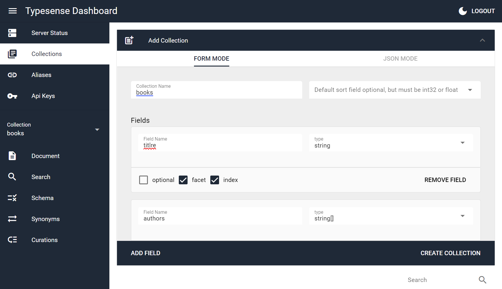 | 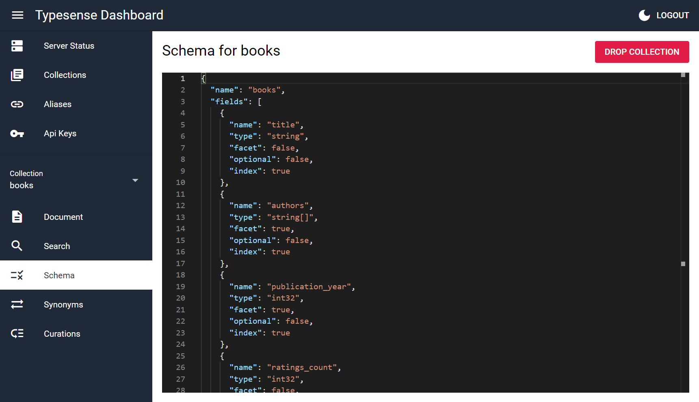 |

<details>
<summary><strong>See more dashboard screenshots</strong></summary>

| Documents                                                        | JSON search                                                             |
| ---------------------------------------------------------------- | ----------------------------------------------------------------------- |
| 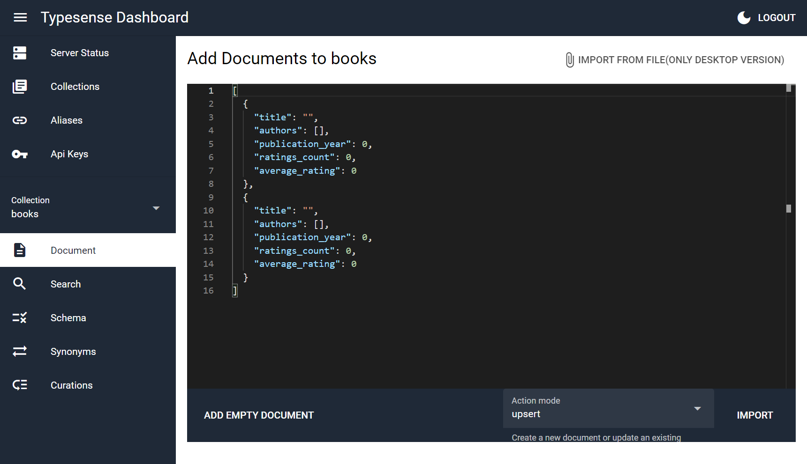 | 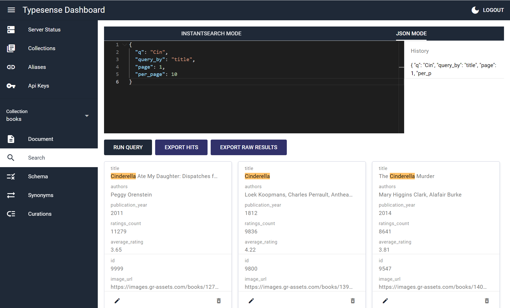 |

| API keys                                              | Collection aliases                                              |
| ----------------------------------------------------- | --------------------------------------------------------------- |
| 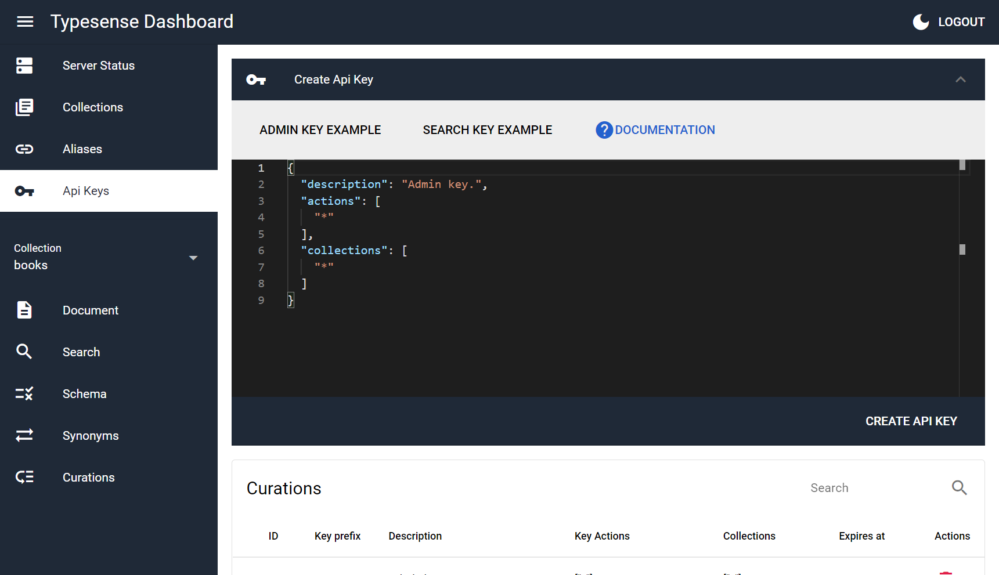 | 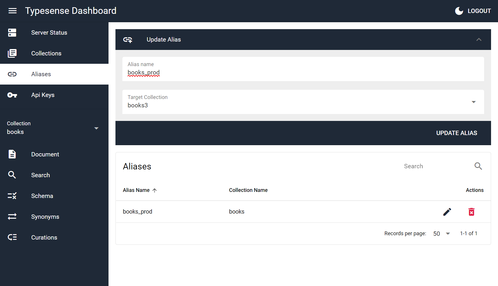 |

| Synonyms                                               | Curations                                                       |
| ------------------------------------------------------ | --------------------------------------------------------------- |
| 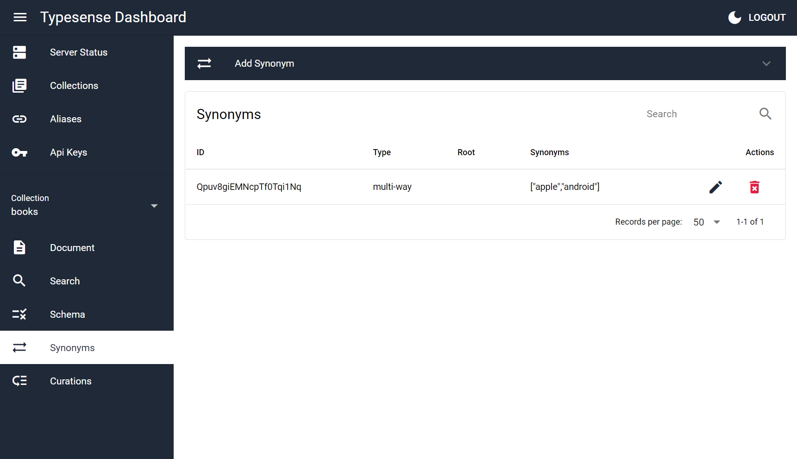 | 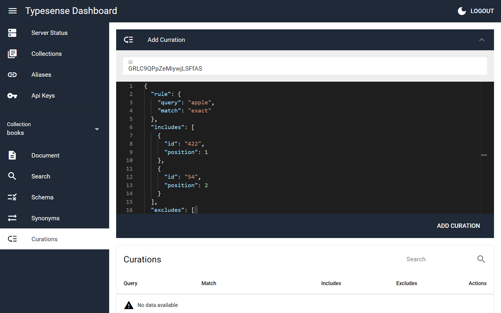 |

</details>

## Why use Typesense Dashboard?

- **Free and open source:** use, inspect, modify, and self-host the dashboard under the GPL-3.0 license.
- **Complete Typesense management UI:** handle everyday administration without writing API requests by hand.
- **Web, Docker, and desktop options:** use the hosted web app, deploy the container, or install the Electron desktop application.
- **Collection and document tools:** create collections, edit schemas, browse documents, and import or export JSON/JSONL data.
- **Search debugging:** test instant search or raw JSON queries and inspect results, filters, facets, and pagination.
- **Search configuration:** manage aliases, synonyms, curations, presets, stopwords, stemming dictionaries, and analytics rules.
- **Server and cluster visibility:** review health, version, memory, disk, network, and node status from one dashboard.

## Quick start

Choose the option that best matches your Typesense setup.

### Use the hosted web dashboard

Open **[bfritscher.github.io/typesense-dashboard](https://bfritscher.github.io/typesense-dashboard/)** and enter your Typesense host, port, protocol, and API key.

For browser access, start Typesense with `--enable-cors`. If the dashboard is served over HTTPS, your Typesense API must also be available over HTTPS; browsers block insecure API requests from secure pages as mixed content.

### Run with Docker

Run the pre-built Typesense Dashboard image:

```bash
docker run -d \
  --name typesense-dashboard \
  -p 80:80 \
  ghcr.io/bfritscher/typesense-dashboard:latest
```

Then open `http://localhost`.

To build the image locally instead:

```bash
docker build -t typesense-dashboard .
docker run -d --name typesense-dashboard -p 80:80 typesense-dashboard
```

The container uses Caddy to serve the static web application. Set the `PUBLIC_PATH` build argument when hosting from a subfolder; the value must start with `/`:

```bash
docker build \
  --build-arg=PUBLIC_PATH=/dashboard \
  -t typesense-dashboard .
```

You can also copy the built static files from `/srv` into another image:

```Dockerfile
FROM alpine
COPY --from=typesense-dashboard /srv /typesense-dashboard
```

### Install the desktop app

Download a build for your operating system from the **[GitHub Releases page](https://github.com/bfritscher/typesense-dashboard/releases)**.

The desktop application avoids browser CORS restrictions and is the better choice for large JSON or JSONL imports and exports. Instant search is currently available only in the web version.

On Linux, make the downloaded AppImage executable before starting it:

```bash
chmod +x Typesense-Dashboard*.AppImage
./Typesense-Dashboard*.AppImage
```

## What you can manage

| Area                 | Typesense dashboard capabilities                                                            |
| -------------------- | ------------------------------------------------------------------------------------------- |
| Server               | Health, version, metrics, cache clearing, snapshots, compaction, and slow-request threshold |
| Clusters             | View tagged Typesense nodes side by side and switch between nodes                           |
| Collections          | List, filter, create, update, and drop collections                                          |
| Documents            | Browse, search, create, edit, delete, import, and export documents                          |
| Search               | Instant search, facets, filters, pagination, and raw JSON queries                           |
| Schema               | Inspect and update collection fields and schema settings                                    |
| Search configuration | Aliases, synonyms, curations, presets, stopwords, and stemming dictionaries                 |
| Access and analytics | API keys and analytics rules                                                                |

## Configuration

The dashboard reads `/config.json` when the web application starts. Use it to configure automatic login, saved server history, cluster tags, and UI options. A documented starting point is available in [`config.json.sample`](./config.json.sample).

When running with Docker, either mount the file into the container:

```bash
docker run -d \
  --name typesense-dashboard \
  -p 80:80 \
  -v /path/to/config.json:/srv/config.json \
  ghcr.io/bfritscher/typesense-dashboard:latest
```

Or provide the complete JSON file as a base64-encoded environment variable:

```bash
docker run -d \
  --name typesense-dashboard \
  -p 80:80 \
  -e TYPESENSE_DASHBOARD_CONFIG="$(base64 -w 0 /path/to/config.json)" \
  ghcr.io/bfritscher/typesense-dashboard:latest
```

Example configuration:

```json
{
  "apiKey": "xyz",
  "node": {
    "host": "search.example.com",
    "port": "443",
    "protocol": "https",
    "path": "",
    "tls": true
  },
  "ui": {
    "hideProjectInfo": false
  },
  "history": [
    {
      "apiKey": "abc",
      "node": {
        "host": "search-staging.example.com",
        "port": "443",
        "protocol": "https",
        "path": "",
        "tls": true
      },
      "clusterTag": "staging-cluster"
    }
  ]
}
```

The `history` entries appear as saved server connections in the dashboard. Set `ui.hideProjectInfo` to `true` to hide the version, GitHub, and issue links from the navigation menu.

### Same-host reverse proxy

Set `node.host` to `"SAME"` when the dashboard and Typesense are reverse-proxied under the same hostname. The dashboard derives the host, protocol, and port from the current page.

```json
{
  "node": {
    "host": "SAME",
    "path": "/api"
  }
}
```

### Cluster status

Add the same `clusterTag` to saved connections that belong to one cluster. When the active connection has a cluster tag, the **Cluster Status** page appears and shows its nodes in a stable order.

Each node card includes its URL, Typesense version, leader or follower role, memory, disk, Typesense metrics, network traffic, and available stats. The active node is highlighted, and you can switch connections directly from a card.

You can add cluster tags from the server-history popover or preconfigure them in `config.json`.

## Local development

### Requirements

- Node.js 20 or newer
- npm 6.13.4 or newer

### Install and run the web app

```bash
npm ci
npm run dev
```

For Electron desktop development:

```bash
npm run dev:desktop
```

Useful checks:

```bash
npm run lint
npm run type-check
npm run build
```

### Development API proxy

During `npm run dev`, set `DEV_API_PROXY_TARGET` to proxy `/api/*` to a remote Typesense origin and avoid browser CORS issues. The development server removes the `/api` prefix before forwarding the request.

```bash
DEV_API_PROXY_TARGET=https://search.example.com npm run dev
```

PowerShell:

```powershell
$env:DEV_API_PROXY_TARGET = "https://search.example.com"; npm run dev
```

## Project development status

The active Vue rewrite is documented separately:

- [Implementation plan](./vue-reimplementation/IMPLEMENTATION_PLAN.md)
- [Vue implementation checklist](./vue-reimplementation/IMPLEMENTATION_CHECKLIST.md)
- [Feature-parity checklist](./docs/parity-checklist.md)
- [Architecture, stack, and security decisions](./vue-reimplementation/STACK.md)

## Known limitations

- The web application requires CORS to be enabled on the Typesense server.
- Browsers require HTTPS for the Typesense API when the dashboard itself uses HTTPS.
- Large browser-based imports and exports can time out; use the desktop app for large files.
- Delete-by-query and scoped search key generation are not currently implemented.
- Instant search is not currently available in the desktop application.

## Contributing

Issues, bug reports, documentation improvements, and pull requests are welcome. If this free Typesense dashboard saves you time, consider starring the repository—it helps other Typesense users discover the project.

## License

Typesense Dashboard is free and open-source software distributed under the [GNU General Public License v3.0](./LICENSE.txt).
